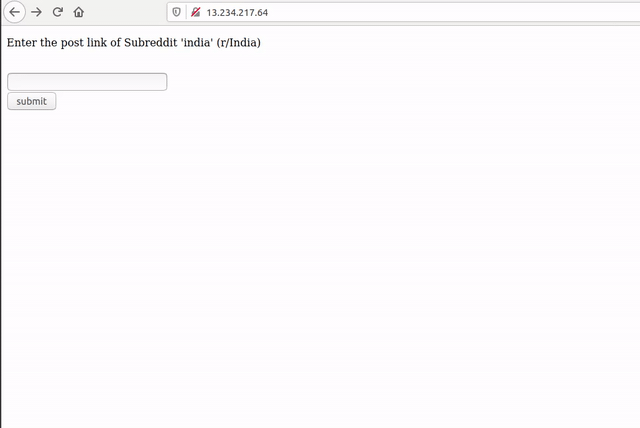
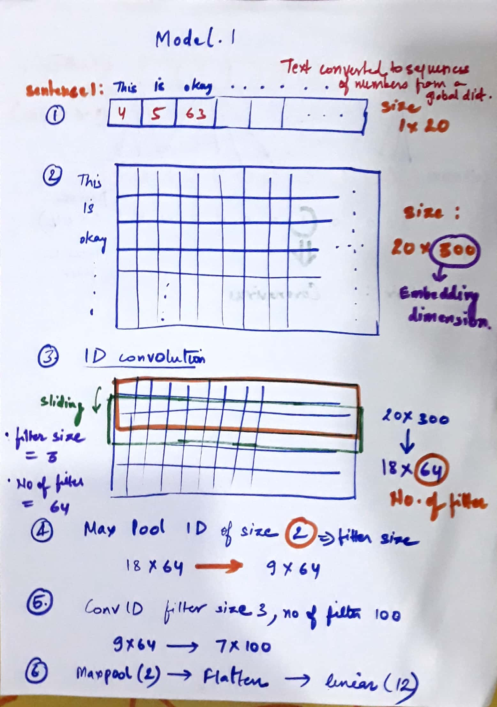
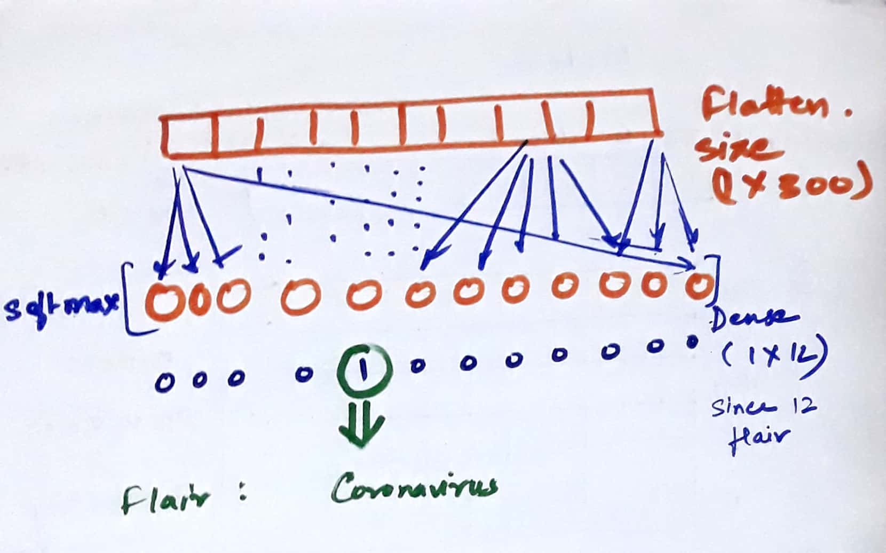
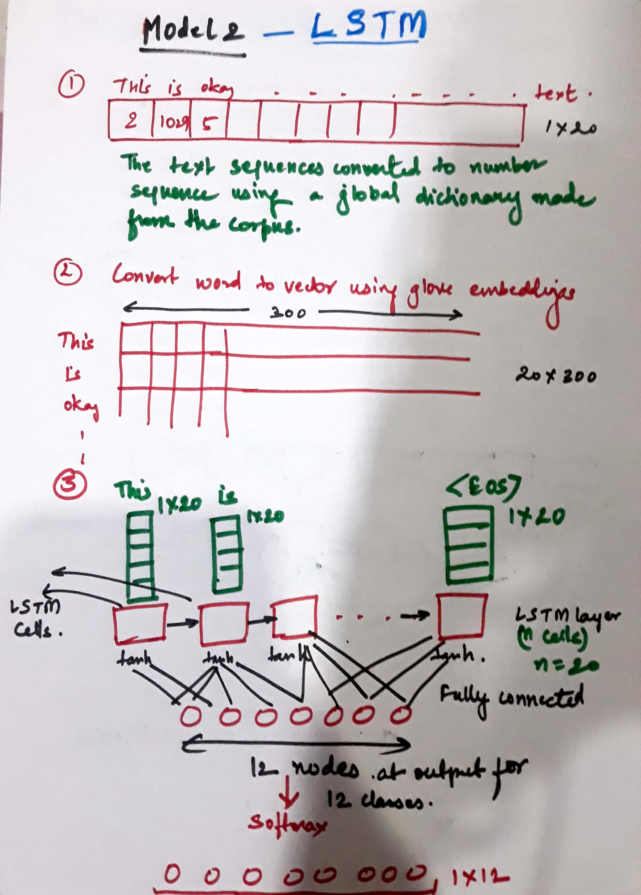
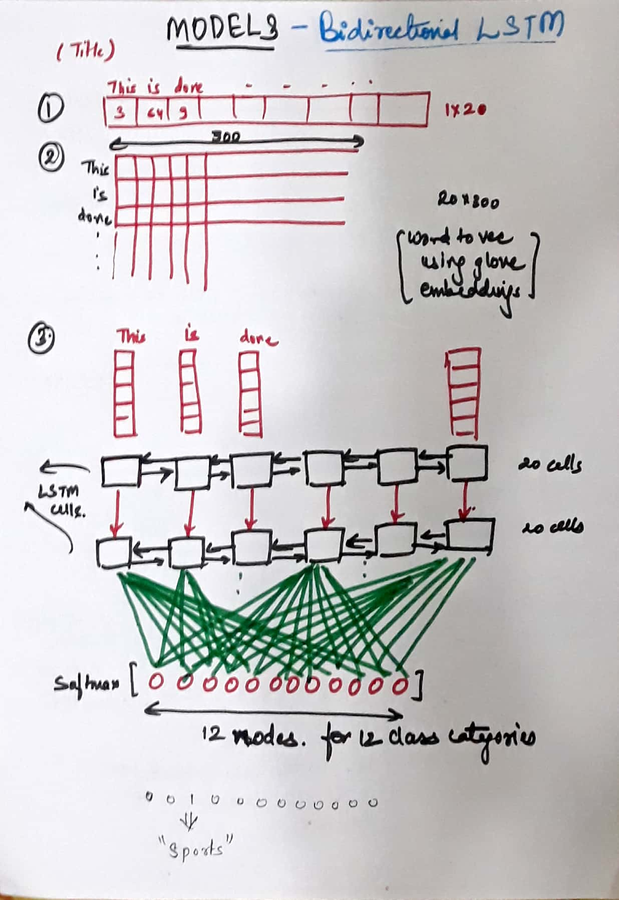

# Reddit_EDA
This project consist of Flair Prediction on reddit posts of r/india. (The term flair, used in some subreddits for 'categorizing' posts submitted by users). EDA has been performed on the subreddit data collected. PRAW: The Python Reddit API Wrapper is used for data collection of the following flairs:   "AskIndia", "Coronavirus", "Non-Political", "Scheduled", "Photography", "Science/Technology", "Politics", "Business/Finance", "Policy/Economy", "Sports", "Food", "AMA".  
**EDA:**  
1. Most Popular Words (WordCloud)
2. Posts with less than 10 votes (histogram)
3. Most Popular Posts (BarPlot)
4. Most Commented Posts (Barplot)
5. No. of Comments vs Score (Regression Plots)
6. Top 10 Authors
7. Text Cleaning and Analysis
8. Bag of Words on 2 Posts of same Flair
9. XG Boost Classifier
10. Feature Importance for Flair Prediction, etc.  

**Prediction Algorithm includes:**  
1. Logistic Regression (sklearn: CountVectorizer -> TFIDF Transformer -> Logistic Regression)
2. SVM (sklearn: CountVectorizer -> TFIDF Transformer -> SVM)
3. Naive Bayes (sklearn: CountVectorizer -> TFIDF Transformer -> Naive Bayes)
[**Code - IPYNB**](https://github.com/ankurbhatia24/Reddit_EDA/blob/master/IPYNB/Testing%20basic%20ML%20Models.ipynb)
4. 1-D Convolution (Tensorflow/Keras: Word2Vec -> GloVE embeddings -> 1-D Convolution)
5. LSTM (Tensorflow/Keras: Word2Vec -> GloVE embeddings -> LSTM)
6. Bidirectional LSTM (Tensorflow/Keras: Word2Vec -> GloVE embeddings -> Bidirectional LSTM)  

## To Test the Application part 1: 
1. Visit: http://13.234.217.64/
2. Enter a reddit post from r/India Subreddit. 

## To Test the Application part 2: 
1. Clone the repository: **git clone https://github.com/ankurbhatia24/Reddit_EDA.git**
2. Edit the file test.txt with the subreddit(india) posts links in each line.
3. Run the python file: **python3 post_text_file.py**  

## To Reproduce the Developement Environment: 
1. Clone the repository: **git clone https://github.com/ankurbhatia24/Reddit_EDA.git**
2. Create a virtual environment: **virtualenv env**
3. Activate virtual environment: **source env/bin/activate**
4. Install the requirements: **pip3 install -r requirements.txt**
5. "Flair_csv" is the Database file: To collect your own data, execute the "Reddit Data Collection.ipynb". Change the reddit instance credentials accordingly.(Read https://towardsdatascience.com/scraping-reddit-with-praw-76efc1d1e1d9 to setup reddit app)
6. After installation of the required libraries, you can test the code in the 'IPYNB'   directory. 

## Understanding Models
### In the 'Data_pre-procesing and Model Evaluation.ipynb', there are three models defined after the preprocessing of the Data.
#### Process: 
1. The Reddit data collected is cleaned and Preprocessed according to the models needs. 
The text is cleaned for any punctuations, emojis, special characters, STOPWORDS(A stop word is a commonly used word (such as “the”, “a”, “an”, “in”)), etc.2
2. The raw text is tokenized (each word/token is assigned a number according to a dictionary) and converted from word to vector using GloVe embeddings (300d).
3. The Flairs (**flairs = ["AskIndia", "Coronavirus", "Non-Political", "Scheduled", "Photography", "Science/Technology", "Politics", "Business/Finance", "Policy/Economy", "Sports", "Food", "AMA"]**) to be predicted are converted to One-Hot encodings.
4. Finally the data is splitted into Training and Testing.
## 1. Convolution Model

## 2. LSTM Model

## 3. Bidirectional LSTM Model

## Other Predictors:
1. https://github.com/saum7800/reddit-flair-prediction
2. https://github.com/Riya-11/Reddit-Flair-Predictor
3. https://github.com/YatinGupta777/Reddit-flare-detector
4. https://github.com/manalarora/reddit-flair-detection
